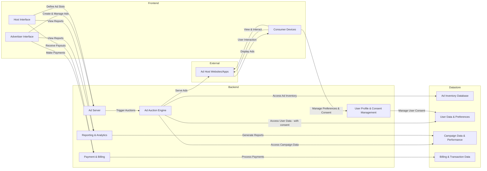

# OpenAds
OpenAds is an open-source project dedicated to enhancing transparency and trust in the advertising ecosystem. By making the entire advertising process, from bidding to serving, completely transparent, OpenAds empowers consumers to understand and control their ad experiences while helping businesses make informed, secure decisions about their ad investments.

Join us in building a more open, fair, and privacy-respecting advertising future.

## Risks to Users Online (Consumers)
Advertising networks run by companies like Google (Alphabet) and Facebook (Meta) are ----

https://en.wikipedia.org/wiki/Facebook%E2%80%93Cambridge_Analytica_data_scandal

## Risks to Advertisers
---

https://www.statista.com/statistics/677466/digital-ad-fraud-cost/

## Architecture

